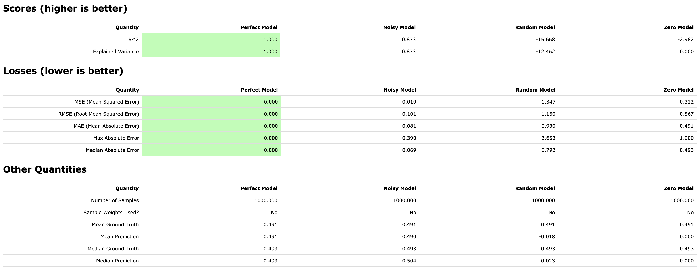
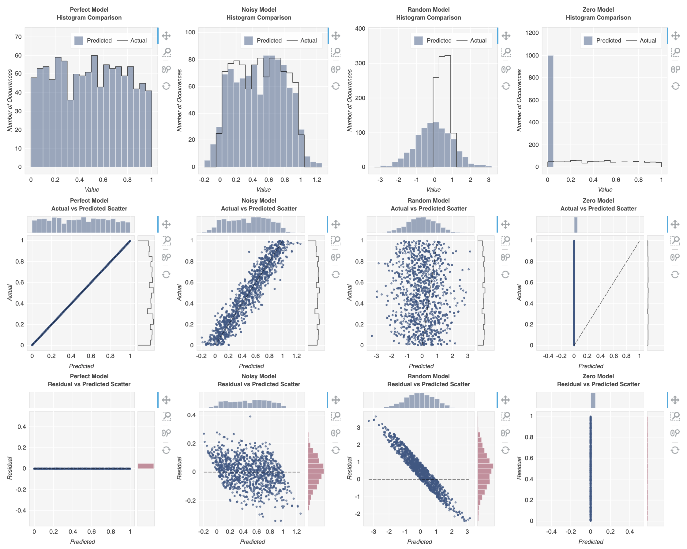
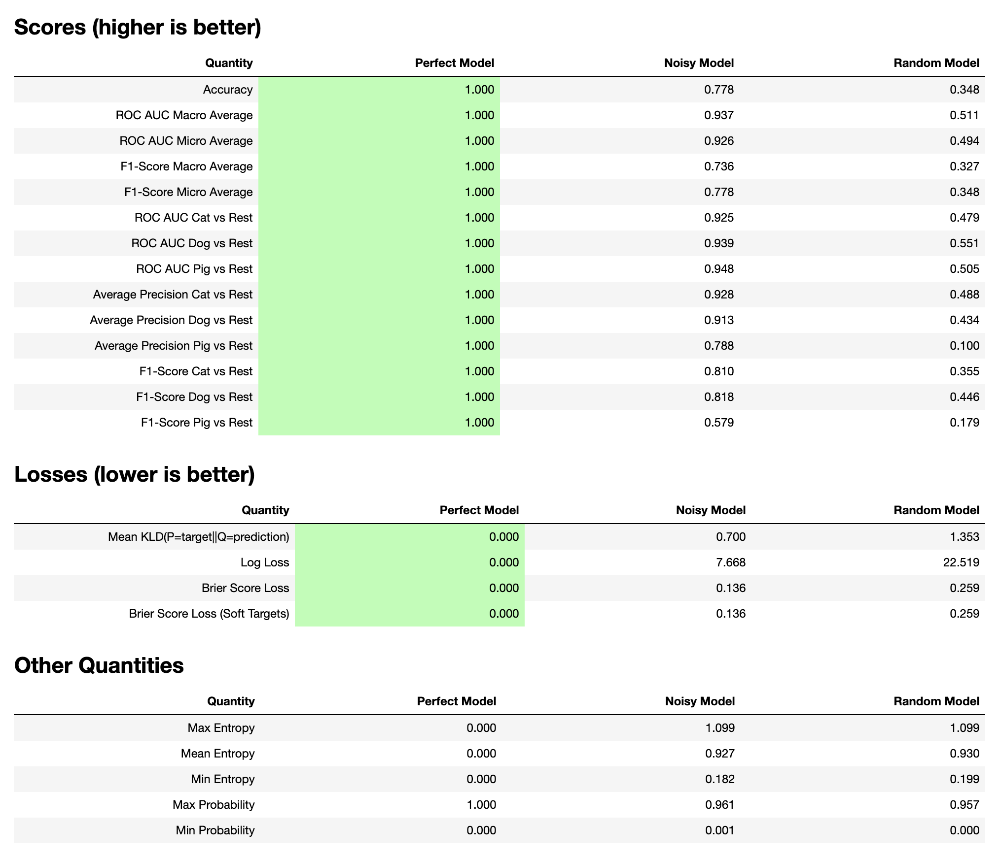
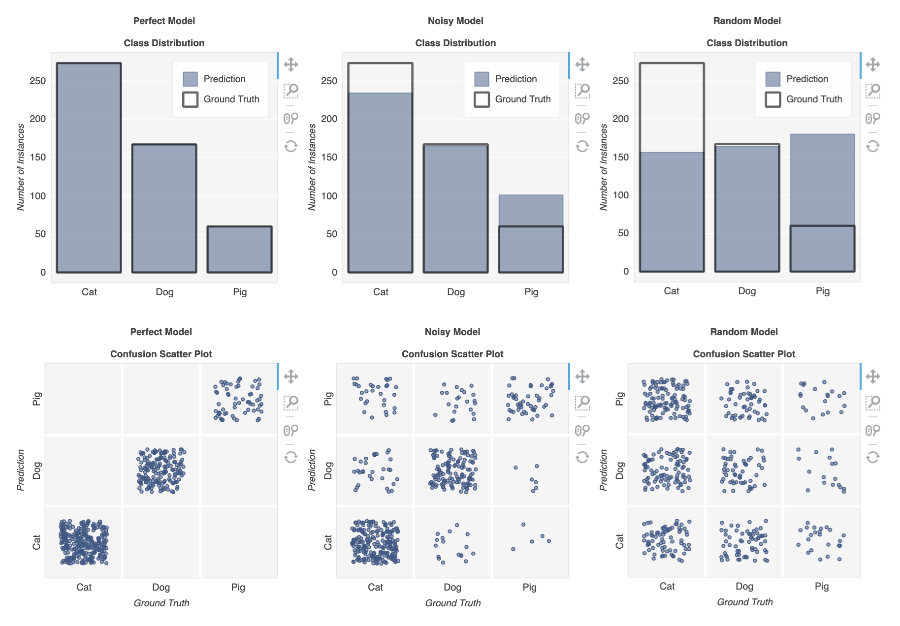
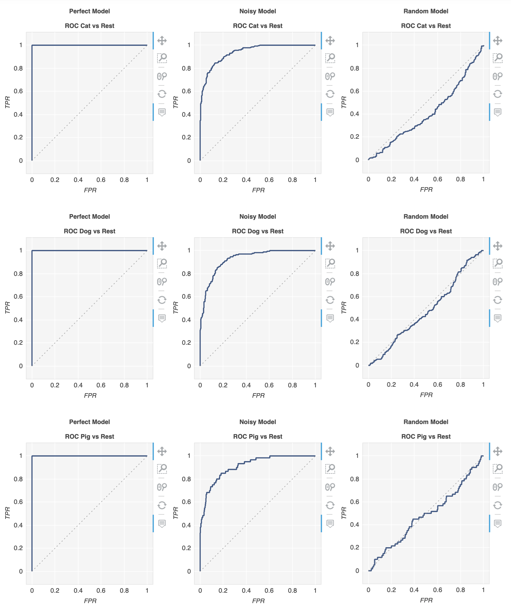
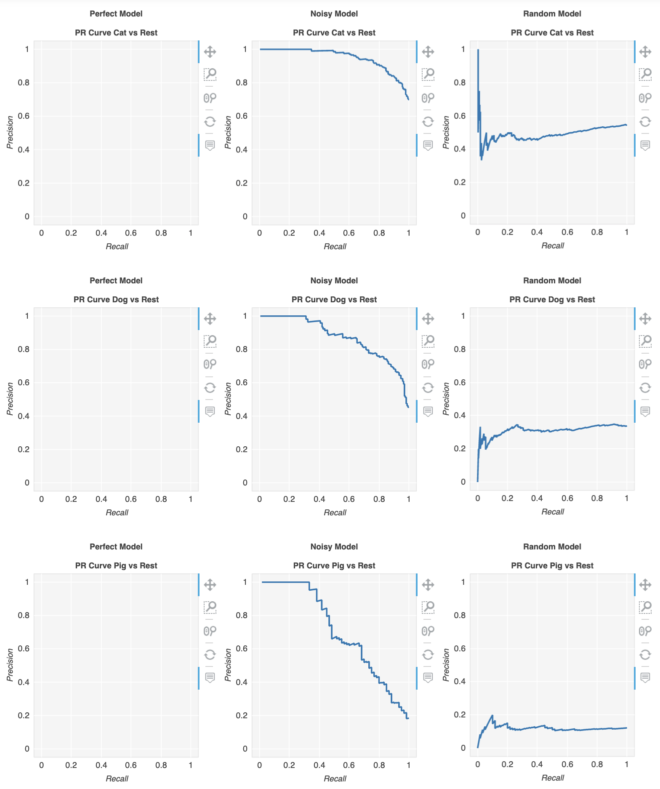

<p align="center">
    <a href="https://mybinder.org/v2/gh/metriculous-ml/metriculous/master?filepath=notebooks">
        
    </a>
    <a href="https://github.com/metriculous-ml/metriculous/actions">
        
    </a>
    <a href="http://mypy-lang.org/">
        
    </a>
    <a href="https://badge.fury.io/py/metriculous">
        
    </a>
    
    
    <a href="https://luminovo.ai/">
        
    </a>
</p>

# __`metriculous`__

Measure, visualize, and compare machine learning model performance without the usual boilerplate.
Breaking API improvements to be expected.


# Installation
```console
$ pip install metriculous
```

Or, for the latest unreleased version:
```console
$ pip install git+https://github.com/metriculous-ml/metriculous.git
```


# Comparing Regression Models  [](https://mybinder.org/v2/gh/metriculous-ml/metriculous/master?filepath=notebooks%2Fquickstart_regression.py)
<details><summary>Click to see more code</summary>
<p>

```python
import numpy as np

# Mock the ground truth, a one-dimensional array of floats
ground_truth = np.random.random(300)

# Mock the output of a few models
perfect_model = ground_truth
noisy_model = ground_truth + 0.1 * np.random.randn(*ground_truth.shape)
random_model = np.random.randn(*ground_truth.shape)
zero_model = np.zeros_like(ground_truth)
```
</p>
</details>

```python
import metriculous

metriculous.compare_regressors(
    ground_truth=ground_truth,
    model_predictions=[perfect_model, noisy_model, random_model, zero_model],
    model_names=["Perfect Model", "Noisy Model", "Random Model", "Zero Model"],
).save_html("comparison.html").display()
```

This will save an HTML file with common regression metrics and charts, and if you are working in a [Jupyter notebook](https://github.com/jupyter/notebook) will display the output right in front of you:






# Comparing Classification Models [](https://mybinder.org/v2/gh/metriculous-ml/metriculous/master?filepath=notebooks%2Fquickstart_classification.py)
<details><summary>Click to see more code</summary>
<p>

```python
import numpy as np


def normalize(array2d: np.ndarray) -> np.ndarray:
    return array2d / array2d.sum(axis=1, keepdims=True)


class_names = ["Cat", "Dog", "Pig"]
num_classes = len(class_names)
num_samples = 500

# Mock ground truth
ground_truth = np.random.choice(range(num_classes), size=num_samples, p=[0.5, 0.4, 0.1])

# Mock model predictions
perfect_model = np.eye(num_classes)[ground_truth]
noisy_model = normalize(
    perfect_model + 2 * np.random.random((num_samples, num_classes))
)
random_model = normalize(np.random.random((num_samples, num_classes)))
```

</p>
</details>

```python
import metriculous

metriculous.compare_classifiers(
    ground_truth=ground_truth,
    model_predictions=[perfect_model, noisy_model, random_model],
    model_names=["Perfect Model", "Noisy Model", "Random Model"],
    class_names=class_names,
    one_vs_all_figures=True,
).display()
```










# Development

### Poetry
This project uses [poetry](https://poetry.eustace.io/) to manage
dependencies. Please make sure it is installed for the required python version. Then install the dependencies with `poetry install`.

### Makefile
A Makefile is used to automate common development workflows. Type `make` or `make help` to see a list of available commands. Before commiting changes it is recommended to run `make format check test`.
